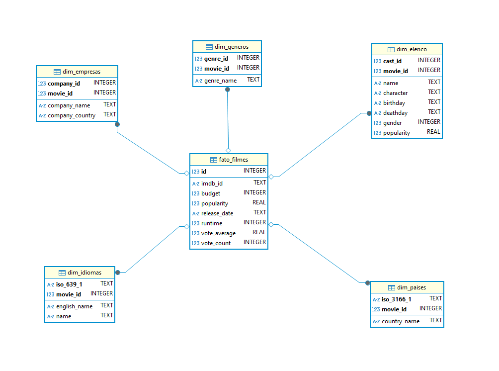
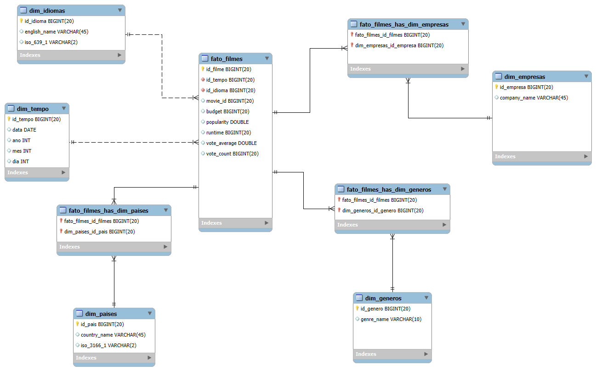
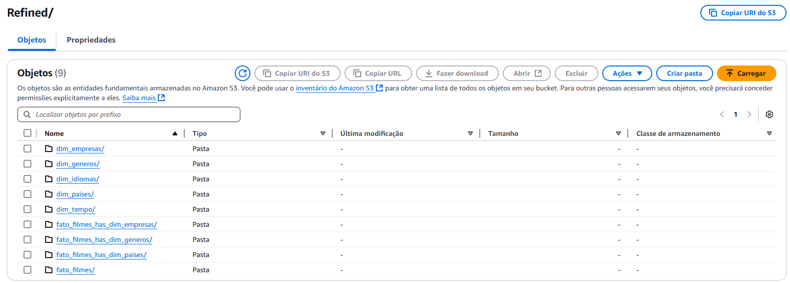
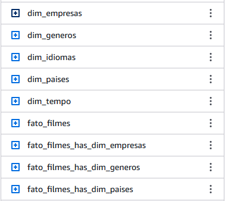
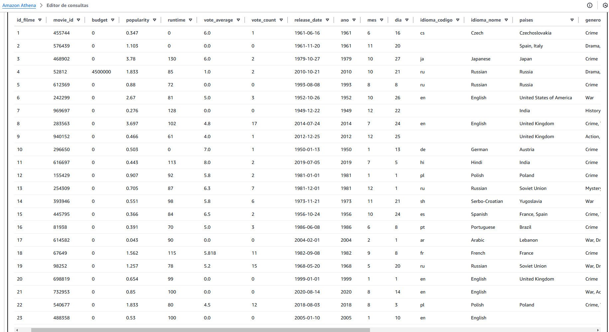

# Objetivo  
O objetivo é praticar a combinação de conhecimentos vistos no programa e fazer um mix de tudo que já foi dito.  

# Perguntas  

Aqui serão analisadas perguntas referentes aos filmes dos gêneros crime e/ou guerra. 

1. **Qual é a distribuição da nota média dos filmes por gênero crime/guerra nas últimas 5 décadas?**  
**Motivo da análise:** Verificar a preferência do público em relação a cada um dos gêneros citados.  

2. **Como o tempo de duração dos filmes se relaciona com a nota média e com o número de votos nas últimas 5 décadas?**  
**Motivo da análise:** Perceber se existe alguma preferência por filmes mais longos ou mais curtos.  

3. **Qual é a proporção de filmes war/crime nas últimas 5 décadas?**  
**Motivo da análise:** Entender se a preferência por um gênero se mantém ou se há oscilações de preferência. Caso haja, qual o motivo para tais oscilações?  

4. **Qual(is) é (são) o(s) país(es) que mais produz(em) filmes de cada gênero nas últimas 5 décadas?**  
**Motivo da análise:** Verificar uma possível fonte e parcerias entre produtoras de países estrangeiros com países que mais produzem filmes desses gêneros.  

5. **Qual é a principal língua falada em cada gênero nas últimas 5 décadas?**  
**Motivo da análise:** Avaliar se existe uma tendência ou preferência por uma determinada língua.  

# Remodelagem dos dados  

Devido ao feedback da sprint anterior, optei por refazer a modelagem e criar tabelas intermediárias para associar a tabela fato às dimensões.  

Inicialmente o modelo proposto se constituia de tabela fato e dimensões, porém havia uma coluna não-numérica na tabela fato e as dimensões eram ligadas a ela por meio de chaves primárias compostas ao invés de IDs únicos, como ilustra a figura a seguir.  

  

Com as alterações feitas, o modelo passa a ter um identificador único por dimensão que faz a ligação com a tabela fato. Nos casos onde as relações possuem cardinalidade de muitos para muitos (m:n), tabelas associativas foram incluídas para corrigir o problema da modelagem inicial.  

  

Para a implementação do modelo atualizado foi necessário fazer o reprocessamento da camada refined, via AWS Glue, com modificações no código original. As modificações garantem que cada dimensão seja criada e devidamente linkada com a tabela fato através de IDs únicos gerados usando a função row_number().  

### **Esquema do Data Warehouse**

| **Tabela**                     | **Coluna**                  | **Tipo de Dados** | **Descrição**                                                                 |
|--------------------------------|-----------------------------|-------------------|-------------------------------------------------------------------------------|
| **fato_filmes**                | id_filme                    | Integer           | Chave primária da tabela fato.                                               |
|                                | id_tempo                    | Integer           | Chave estrangeira para `dim_tempo`.                                           |
|                                | id_idioma                   | Integer           | Chave estrangeira para `dim_idiomas`.                                         |
|                                | movie_id                    | Integer           | ID original do filme.                                                         |
|                                | budget                      | Decimal           | Orçamento do filme.                                                           |
|                                | popularity                  | Decimal           | Popularidade do filme.                                                        |
|                                | runtime                     | Integer           | Duração do filme em minutos.                                                  |
|                                | vote_average                | Decimal           | Média de votos do filme.                                                      |
|                                | vote_count                  | Integer           | Número total de votos do filme.                                               |
| **dim_tempo**                  | id_tempo                    | Integer           | Chave primária da dimensão tempo.                                             |
|                                | data                        | Date              | Data de lançamento do filme.                                                  |
|                                | ano                         | Integer           | Ano extraído da data de lançamento.                                           |
|                                | mes                         | Integer           | Mês extraído da data de lançamento.                                           |
|                                | dia                         | Integer           | Dia extraído da data de lançamento.                                           |
| **dim_idiomas**                | id_idioma                   | Integer           | Chave primária da dimensão idiomas.                                           |
|                                | iso_639_1                   | String            | Código ISO 639-1 do idioma.                                                   |
|                                | english_name                | String            | Nome do idioma em inglês.                                                     |
| **dim_paises**                 | id_pais                     | Integer           | Chave primária da dimensão países.                                            |
|                                | iso_3166_1                  | String            | Código ISO 3166-1 do país.                                                    |
|                                | country_name                | String            | Nome do país.                                                                 |
| **dim_empresas**               | id_empresa                  | Integer           | Chave primária da dimensão empresas.                                          |
|                                | company_name                | String            | Nome da empresa de produção.                                                  |
| **dim_generos**                | id_genero                   | Integer           | Chave primária da dimensão gêneros.                                           |
|                                | genre_name                  | String            | Nome do gênero do filme.                                                      |
| **fato_filmes_has_dim_paises** | fato_filmes_id_filme        | Integer           | Chave estrangeira para `fato_filmes.id_filme`.                                |
|                                | dim_paises_id_pais          | Integer           | Chave estrangeira para `dim_paises.id_pais`.                                  |
| **fato_filmes_has_dim_generos**| fato_filmes_id_filme        | Integer           | Chave estrangeira para `fato_filmes.id_filme`.                                |
|                                | dim_generos_id_genero       | Integer           | Chave estrangeira para `dim_generos.id_genero`.                               |
| **fato_filmes_has_dim_empresas**| fato_filmes_id_filme        | Integer           | Chave estrangeira para `fato_filmes.id_filme`.                                |
|                                | dim_empresas_id_empresa     | Integer           | Chave estrangeira para `dim_empresas.id_empresa`.                             |

---

### **Relacionamentos**

1. **Tabela Fato (`fato_filmes`)**:
   - Relacionada com `dim_tempo` através de `id_tempo`.
   - Relacionada com `dim_idiomas` através de `id_idioma`.
   - Relacionada com `dim_paises`, `dim_generos` e `dim_empresas` através das tabelas intermediárias.

2. **Tabelas Intermediárias**:
   - `fato_filmes_has_dim_paises`: Relaciona `fato_filmes` com `dim_paises`.
   - `fato_filmes_has_dim_generos`: Relaciona `fato_filmes` com `dim_generos`.
   - `fato_filmes_has_dim_empresas`: Relaciona `fato_filmes` com `dim_empresas`.

---

### **Explicação do Esquema**

- **Tabela Fato (`fato_filmes`)**: Armazena as métricas principais dos filmes (orçamento, popularidade, duração, ID original, média de notas e contagem de votos) e faz referência às dimensões de tempo, idiomas e tabelas intermediárias.
- **Tabelas Dimensionais (`dim_tempo`, `dim_idiomas`, `dim_paises`, `dim_empresas`, `dim_generos`)**: Armazenam informações descritivas e categorizadas sobre datas, idiomas, países, empresas produtoras e gêneros.
- **Tabelas Intermediárias**: Permitem relacionamentos muitos-para-muitos entre a tabela fato e as dimensões de países, gêneros e empresas.

---  

# Códigos e Execução  
O código do job executado no glue pode ser encontrado na íntegra clicando [aqui](../Desafio/processamento_refined.py)
 
```python
import sys
from awsglue.utils import getResolvedOptions
from awsglue.context import GlueContext
from awsglue.job import Job
from pyspark.context import SparkContext
from pyspark.sql.functions import explode, col, lit, year, month, dayofmonth, row_number
from awsglue.dynamicframe import DynamicFrame
from pyspark.sql import Window

args = getResolvedOptions(sys.argv, ['JOB_NAME', 'S3_INPUT_PATH', 'S3_TARGET_PATH'])
input_path = args['S3_INPUT_PATH']
target_path = args['S3_TARGET_PATH']

sc = SparkContext()
glueContext = GlueContext(sc)
spark = glueContext.spark_session
job = Job(glueContext)
job.init(args['JOB_NAME'], args)  

dyf = glueContext.create_dynamic_frame.from_options(
    connection_type="s3",
    connection_options={"paths": [input_path]},
    format="parquet"
)
df = dyf.toDF().dropDuplicates()
```  
No trecho acima são importadas as bibliotecas necessárias e também configurados os parâmetros de variável ambiente 'S3_INPUT_PATH' e 'S3_TARGET_PATH'. Em S3_INPUT_PATH o caminho é direcionado para a trusted zone (s3://desafio-final-pb-welder/Trusted/TMDB/) e em S3_TARGET_PATH o caminho é direcionado para o diretório Refined (s3://desafio-final-pb-welder/Refined/) onde serão criadas as tabelas via execução do Crawler.  

```python
# Criar Dimensão Tempo
dim_tempo = df.select(col("release_date").alias("data")) \
    .withColumn("ano", year(col("data"))) \
    .withColumn("mes", month(col("data"))) \
    .withColumn("dia", dayofmonth(col("data"))) \
    .dropDuplicates() \
    .withColumn("id_tempo", row_number().over(Window.orderBy(col("data"))))

# Criar Dimensão Idiomas
dim_idiomas = df.withColumn("language", explode(col("spoken_languages"))) \
    .select(
        col("language.iso_639_1").alias("iso_639_1"),
        col("language.english_name").alias("english_name")
    ).dropDuplicates() \
    .withColumn("id_idioma", row_number().over(Window.orderBy(lit(1))))

# Criar Dimensão Países
dim_paises = df.withColumn("country", explode(col("production_countries"))) \
    .select(
        col("country.iso_3166_1").alias("iso_3166_1"),
        col("country.name").alias("country_name")
    ).dropDuplicates() \
    .withColumn("id_pais", row_number().over(Window.orderBy(lit(1))))

# Criar Dimensão Empresas
dim_empresas = df.withColumn("company", explode(col("production_companies"))) \
    .select(
        col("company.name").alias("company_name")
    ).dropDuplicates() \
    .withColumn("id_empresa", row_number().over(Window.orderBy(lit(1))))

# Criar Dimensão Gêneros
dim_generos = df.withColumn("genre", explode(col("genres"))) \
    .select(
        col("genre.name").alias("genre_name")
    ).dropDuplicates() \
    .withColumn("id_genero", row_number().over(Window.orderBy(lit(1))))

# Criar Tabela Fato
fato_filmes = df.select(
    col("id").alias("movie_id"),
    col("budget"),
    col("popularity"),
    col("runtime"),
    col("vote_average"),
    col("vote_count"),
    col("release_date").alias("data"),
    col("spoken_languages").getItem(0).getField("iso_639_1").alias("idioma_iso")
).dropDuplicates() \
.withColumn("id_filme", row_number().over(Window.orderBy(lit(1))))

fato_filmes = fato_filmes.join(dim_tempo, fato_filmes.data == dim_tempo.data, "left").drop(dim_tempo.data).drop(fato_filmes.data)
fato_filmes = fato_filmes.join(dim_idiomas, fato_filmes.idioma_iso == dim_idiomas.iso_639_1, "left") \
    .drop(dim_idiomas.iso_639_1).drop(fato_filmes.idioma_iso) \
    .withColumnRenamed("id_idioma", "id_idioma")

# Reorganizar colunas na tabela fato_filmes
fato_filmes = fato_filmes.select(
    "id_filme", "id_tempo", "id_idioma", "movie_id", "budget", "popularity", "runtime", "vote_average", "vote_count"
)

# Criar Tabelas Intermediárias corretamente antes do JOIN
fato_filmes_has_dim_paises = df.withColumn("country", explode(col("production_countries"))).dropna() \
    .select(col("id").alias("movie_id"), col("country.iso_3166_1").alias("iso_3166_1")) \
    .join(fato_filmes, "movie_id", "left") \
    .join(dim_paises, "iso_3166_1", "left") \
    .select(col("id_filme").alias("fato_filmes_id_filme"), col("id_pais").alias("dim_paises_id_pais"))

fato_filmes_has_dim_generos = df.withColumn("genre", explode(col("genres"))).dropna() \
    .select(col("id").alias("movie_id"), col("genre.name").alias("genre_name")) \
    .join(fato_filmes, "movie_id", "left") \
    .join(dim_generos, "genre_name", "left") \
    .select(col("id_filme").alias("fato_filmes_id_filme"), col("id_genero").alias("dim_generos_id_genero"))

fato_filmes_has_dim_empresas = df.withColumn("company", explode(col("production_companies"))).dropna() \
    .select(col("id").alias("movie_id"), col("company.name").alias("company_name")) \
    .join(fato_filmes, "movie_id", "left") \
    .join(dim_empresas, "company_name", "left") \
    .select(col("id_filme").alias("fato_filmes_id_filme"), col("id_empresa").alias("dim_empresas_id_empresa"))

# Salvar tabelas
fato_filmes.write.mode("overwrite").parquet(f"{target_path}/fato_filmes")
dim_tempo.write.mode("overwrite").parquet(f"{target_path}/dim_tempo")
dim_idiomas.write.mode("overwrite").parquet(f"{target_path}/dim_idiomas")
dim_paises.write.mode("overwrite").parquet(f"{target_path}/dim_paises")
dim_empresas.write.mode("overwrite").parquet(f"{target_path}/dim_empresas")
dim_generos.write.mode("overwrite").parquet(f"{target_path}/dim_generos")
fato_filmes_has_dim_paises.write.mode("overwrite").parquet(f"{target_path}/fato_filmes_has_dim_paises")
fato_filmes_has_dim_generos.write.mode("overwrite").parquet(f"{target_path}/fato_filmes_has_dim_generos")
fato_filmes_has_dim_empresas.write.mode("overwrite").parquet(f"{target_path}/fato_filmes_has_dim_empresas")

job.commit()
```  

Após a leitura dos arquivos parquet da camada trusted, o script cria dataframes menores que depois serão salvos como tabelas no destino especificado. É importante ressaltar que em colunas nas quais havia dados aninhados, o comando explode foi utilizado para desacoplar as subcolunas dentro do struct e assim permitindo a criação do modelo.  

O resultado da execução do job foi o conjunto de pastas ilustrado na figura abaixo.  
  

Após a execução do job no glue, o crawler criado na sprint anterior foi executado novamente e o resultado no glue catalog está ilustrado na figura a seguir.  

<br>  

Para verificação dos dados e da coerência do modelo, foi utilizada uma query via AWS Athena. A query tem como intuito fazer os joins possíveis e construir uma única tabela contendo todas as colunas de todas as dimensões.  

Os dados disponíveis para consulta estão listados no Athena:
  

O código da query utilizada foi: 
```sql
SELECT 
    f.id_filme,
    f.movie_id,
    f.budget,
    f.popularity,
    f.runtime,
    f.vote_average,
    f.vote_count,

    -- Informações da dimensão Tempo
    t.data AS release_date,
    t.ano,
    t.mes,
    t.dia,

    -- Idioma do filme
    i.iso_639_1 AS idioma_codigo,
    i.english_name AS idioma_nome,

    -- Países associados ao filme (agrupados em uma única coluna)
    ARRAY_JOIN(ARRAY_AGG(DISTINCT p.country_name), ', ') AS paises,

    -- Gêneros associados ao filme (agrupados em uma única coluna)
    ARRAY_JOIN(ARRAY_AGG(DISTINCT g.genre_name), ', ') AS generos,

    -- Empresas associadas ao filme (agrupadas em uma única coluna)
    ARRAY_JOIN(ARRAY_AGG(DISTINCT e.company_name), ', ') AS empresas

FROM fato_filmes f

-- Associação com a dimensão Tempo
LEFT JOIN dim_tempo t ON f.id_tempo = t.id_tempo

-- Associação com a dimensão Idiomas
LEFT JOIN dim_idiomas i ON f.id_idioma = i.id_idioma

-- Associação com a tabela intermediária de países e depois com a dimensão Países
LEFT JOIN fato_filmes_has_dim_paises fp ON f.id_filme = fp.fato_filmes_id_filme
LEFT JOIN dim_paises p ON fp.dim_paises_id_pais = p.id_pais

-- Associação com a tabela intermediária de gêneros e depois com a dimensão Gêneros
LEFT JOIN fato_filmes_has_dim_generos fg ON f.id_filme = fg.fato_filmes_id_filme
LEFT JOIN dim_generos g ON fg.dim_generos_id_genero = g.id_genero

-- Associação com a tabela intermediária de empresas e depois com a dimensão Empresas
LEFT JOIN fato_filmes_has_dim_empresas fe ON f.id_filme = fe.fato_filmes_id_filme
LEFT JOIN dim_empresas e ON fe.dim_empresas_id_empresa = e.id_empresa

-- Agrupar os resultados por filme
GROUP BY 
    f.id_filme, 
    f.movie_id, 
    f.budget, 
    f.popularity, 
    f.runtime, 
    f.vote_average, 
    f.vote_count, 
    t.data, 
    t.ano, 
    t.mes, 
    t.dia, 
    i.iso_639_1, 
    i.english_name

-- Ordenar os resultados pelo identificador único do filme
ORDER BY f.id_filme;
```  

Para colunas multivaloradas, optei por fazer a união e apresentar os valores em apenas uma linha para que a visualização ficasse mais organizada.  

A figura abaixo ilustram o resultado da query.  
  

<br> 
 


# Links
[📜**Certificados**](/Sprint10/Certificados/)  
[🕵️‍♂️**Evidências** ](/Sprint10/Evidencias/)  
[💪**Exercícios**](/Sprint10/Exercicios/)  
[🖳 **Desafio**](/Sprint10/Desafio/README.md)  