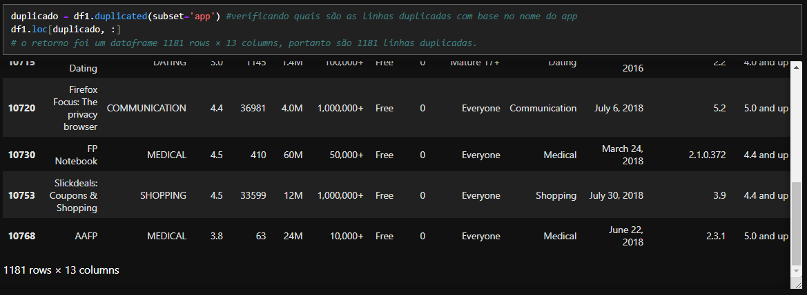
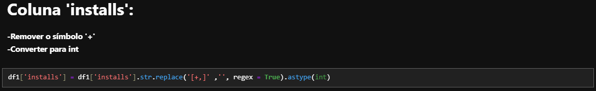
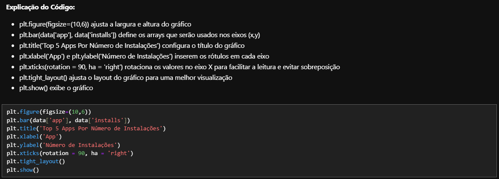
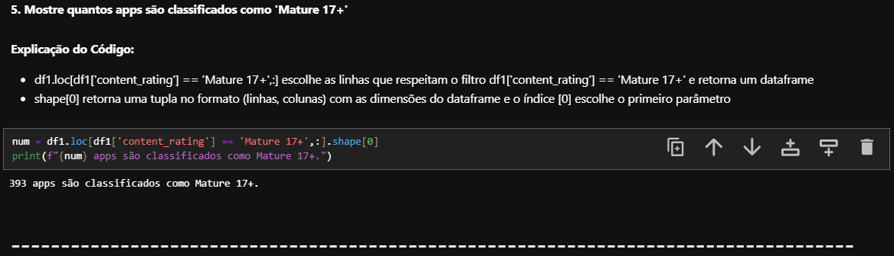

# Etapas

## **1. Preparação do ambiente**  

Nessa etapa devemos nos certificar que as bibliotecas Pandas e Matplotlib estejam instaladas. Para isso foi executado o código abaixo e nenhum erro foi retornado pois as bibliotecas já haviam sido previamente instaladas.

```python
import pandas as pd
import matplotlib.pyplot as plt #importado módulo pyplot
```

## **2. Desenvolvimento do Desafio**

**O código foi dividido em 5 áreas:**  
    - Importação das bibliotecas  
    - Definição de funções auxiliares  
    - Carregamento dos dados  
    - Tratamento dos dados  
    - Execução das perguntas  

Vale lembrar que as evidências aqui registradas são referentes ao arquivo [desafio_final.ipynb](../Desafio/etapa-2/desafio_final.ipynb) que foi gerado depois do arquivo [desafio.ipynb](../Desafio/etapa-2/desafio.ipynb).  
Primeiro o desafio foi executado de maneira sequencial e durante seu desenvolvimento foram identificados alguns pontos que poderiam ser melhor pensados e estruturados. Por esse motivo, foi feita uma reestruturação do código e até mesmo alteração nos últimos exercícios.  

# 1. Importação das Bibliotecas  
```python
import pandas as pd
import matplotlib.pyplot as plt
import inflection 

# Usando a cláusula ''as'' para renomear a biblioteca, exceto a inflection por será usada uma única vez.
```
  

# 2. Funções Auxiliares
Aqui defini duas funções para auxiliar no tratamento e na análise dos dados.
A função **rename_columns(dataframe)** recebe o dataframe, e coloca todas as linhas em um padrão sem espaços, com underlines e lower case. Portanto, se o nome da coluna é 'Nome da Coluna', após a aplicação da função passará a ser 'nome_da_coluna'.

A função **remove_duplicatas(dataframe)** recebe o dataframe e remove as linhas que possuem o mesmo nome de aplicativo.


# 3. Carregamento dos Dados  
Aqui faço o carregamento dos dados e uma cópia de segurança e verifico a execução da cópia **df1**.
  

# 4. Tratamento Dos Dados  
**4.1 Renomeando as colunas**
  

**4.2 Verificando as linhas duplicadas** 
  

**4.3 Removendo as linhas duplicadas**  
Note que aqui o número de linhas do dataframe resultante é 9660, que é exatamente a diferença entre o número de linhas inicial do dataframe e as linhas duplicadas (10841 - 1181 = 9660).
  

**4.4 Busca por Inconsistências**  
Aqui podemos notar a presença do valor '1.9' na coluna 'category'.
  

**4.5 Verificando a Divergência**  
Aqui percebemos que há apenas uma linha com essa inconsistência.
  

**4.6 Excluindo a Divergência**  
Aqui optei por fazer a exclusão da linha divergente mas, em uma situação real, a melhor opção seria falar com a área de negócio e juntos tomar uma decisão sobre como tratar a divergência.


**4.7 Verificação Dos Tipos de Dados das Colunas**  
  

**4.7.1 Alterando o Tipo da Coluna Installs**  
  

**4.7.2 Alterando o Tipo da Coluna Price**  
  

**4.7.3 Alterando o Tipo da Coluna Reviews**  


**4.7.4 Verificando as Alterações**  
  

# 5. Execução das Perguntas e Respostas  
**2. Faça um gráfico de barras contendo os top 5 apps por número de instalação.**


 

**3. Faça um gráfico de pizza (pie chart) mostrando as categorias de apps existentes no dataset de acordo com a frequência em que elas aparecem.**  
  

  

**4. Mostre qual o app mais caro existente no dataset**  
  

**5. Mostre quantos apps são classificados como 'Mature 17+'**  
  

**6. Mostre o top 10 apps por número de reviews bem como o respectivo número de reviews. Ordene a lista de forma decrescente por número de reviews**  
  

**7. Crie pelo menos mais 2 cálculos sobre o dataset e apresente um em formato de lista e o outro em formato de valor. Por exemplo: "top 10 apps por número de reviews" e "o app mais caro existente no dataset"**  

Aqui escolhi visualizar para formato de lista a quantidade de apps com média 4.9 por categoria.  
  

Para o formato valor, escolhi a quantidade de apps com a menor quantidade de avaliações.  
  

**8. Crie pelo menos outras 2 formas gráficas de exibição dos indicadores acima utilizando matplotlib. Escolha tipos de gráficos diferentes dos explorados acima. Por exemplo: linhas e dispersão.**  
Visualização gráfica do exercício 7 parte 1.
  
  
  
**Top 10 Preço médio por categoria**
  


    


