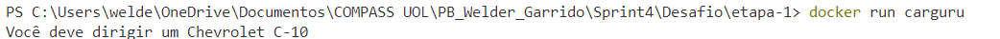

# Objetivo  
O objetivo é a prática de Python com Containers Docker combinando conhecimentos adquiridos no PB.

# Etapas


**Etapa - 1**

Construa uma imagem a partir de um arquivo de instruções Dockerfile que execute o código carguru.py. Após, execute um container a partir da imagem criada. 

O código do arquivo [carguru.py](../Desafio/etapa-1/carguru.py):  
```python
import random

carros = ['Chevrolet Agile','Chevrolet C-10','Chevrolet Camaro','Chevrolet Caravan',
          'Chevrolet Celta','Chevrolet Chevette','Chevrolet Corsa','Chevrolet Covalt',
          'Chevrolet D-20','Chevrolet Monza','Chevrolet Onix','Chevrolet Opala','Chevrolet Veraneio',
          'Citroën C3','Fiat 147','Fiat Argo','Fiat Cronos','Fiat Mobi','Fiat Panorama','Ford Corcel',
          'Ford Escort','Ford F-1000','Ford Ka','Ford Maverick','Honda City','Honda Fit','Hyundai Azera',
          'Hyundai HB20','Hyundai IX-35','Hyundai Veloster','Peugeot 2008','Peugeot 206','Peugeot 208',
          'Peugeot 3008','Peugeot 306','Peugeot 308','Renault Kwid','Renault Logan','Renault Sandero',
          'Renault Twingo','Renault Zoe','Toyota Etios','Toyota Yaris ','Volkswagen Apolo','Volkswagen Bora',
          'Volkswagen Brasilia   ','Volkswagen Fusca','Volkswagen Gol','Volkswagen Kombi','Volkswagen Parati',
          'Volkswagen Passat','Volkswagen Polo','Volkswagen SP2','Volkswagen Santana','Volkswagen Voyage','Volkswagen up!']

random_carros = random.choice(carros)

print('Você deve dirigir um '+ random_carros)
```

Código do arquivo [Dockerfile](../Desafio/etapa-1/Dockerfile):
```Docker
FROM python:3.9-slim 

COPY carguru.py /app/carguru.py

WORKDIR /app 

CMD ["python", "carguru.py"]
```
O código Docker acima tem o intuito de definir a imagem base, **python 3.9-slim**, que é uma versão mais leve do Python que escolhi para efeito de redução no tamanho da imagem.  

O comando **COPY** copia o arquivo carguru.py para o diretório /app na imagem Docker e mantém o nome do arquivo.  

O comando **WORKDIR** configura o diretório padrão de trabalho.  

O comando **CMD** define o que será executado ao iniciar o container e, no caso, executará o script carguru.py usando o Python.  

Para construir o container foi usado, no terminal, o comando:
```
docker build -t carguru .
```
- **docker build**: comando usado para a consrução da imagem.  
- **-t carguru**: define uma tag para a imagem  
- **.** : o uso do **.** especifica que a construção do container deve er feito no diretório atual.   

Ao rodar esse comando, o resultado a seguir foi obtido.  
  

Em seguida, foi executado o comando:  
```bash 
docker run carguru
```
A resposta obtida foi:  


Para fins de teste, o comando foi executado novamente e a resposta obtida foi:  
  

**Etapa - 2**  
É possível reutilizar containers? Em caso positivo, apresente o comando necessário para reiniciar um dos containers parados em seu ambiente Docker? Não sendo possível reutilizar, justifique sua resposta. 

Sim, é possivel reutilizar os containers Docker que foram parados.  

Para listar os containers que já foram executados na máquina, executa o comando: 

```bash
docker ps -a
```
Como resposta você obterá uma lista dos containers já rodados em sua máquina, como mostra a figura a seguir.


Através da lista podemos obter o ID e o nome do container e então reutilizá-lo através do comando:

```bash
docker start <containerID>
```
ou ainda :
```bash
docker start <NomeDoContainer>
```  

É interessante ressaltar que os comandos servem tanto para o ID, quanto para o nome do container, mas também servem para parte do ID.

| **CONTAINER ID**   | **IMAGE**     | **COMMAND**               | **CREATED**          | **STATUS**                       | **PORTS** | **NAMES**         |
|----------------|-----------|-----------------------|------------------|------------------------------ |-------|---------------|
| 4e90b90161ec   | carguru   | "python carguru.py"   | 25 minutes ago   | Exited (0) About a minute ago |       | sharp_carver  |  

A tabela acima ilustra a primeira linha de resposta ao comando docker ps -a da figura anterior.  
Para iniciarmos o container, podemos executar os comandos:
```bash
docker start 4e90b90161ec
```
```bash
docker start sharp_carver
```

Ou ainda usando apenas parte do ID, por exemplo:
```bash
docker start 4e9
```

Abaixo segue figura ilustrando a execução com parte do ID e usando o terminal iterativo através da flag -ai.

```bash
docker start -ai 4e9
```
Obtendo o resultado abaixo.  


**Observações gerais**  

Apesar de ser possível reutilizar containers, há situações em que a prática é mais (ou menos) recomendada.  
A arquitetura de construção Docker permite que possamos tratar os containers como descartáveis, pois isso pode ajudar a eliminar quaisquer inconsistências ou resíduos que estiverem no projeto a ser executado.  
Por outro lado, reutilizar containers pode ser uma forma de economia de tempo caso o ambiente seja estável e se você deseja manter as configurações utilizadas anteriormente.  

**Etapa - 3**  
Agora vamos exercitar a criação de um container que permita receber inputs durante sua execução.
Abaixo seguem as instruções.
		
1. Criar novo script Python que implementa o algorítmo a seguir:
    - receber uma string via input 
    - gerar o hash da string por meio do algorítmo SHA-1
    - Imprimir o hash em tela, utilizando o método hexdigest 
    - Retornar ao passo 1
    
2. Criar uma imagem Docker chamada mascarar-dados que execute o script Python criado anteriormente.

3. Iniciar um container a partir da imagem, enviando algumas palavras para mascaramento.

4. Registrar o conteúdo do script Python, arquivo Dockerfile e comando de inicialização do container neste espaço.  

O código do script [mascara.py](../Desafio/etapa-3/mascara.py) pode ser visto a seguir:
```python 
import hashlib

continua = True 

while continua:
    entrada = input("Digite uma sentença ou 'sair' para encerrar.\n")

    if entrada.strip().lower() == 'sair':
        print('Fechando a aplicação.')
        continua = False
    else:
        cod_hash = hashlib.sha1(entrada.encode())
        print('Hash gerado através da entrada fornecida:')
        print(cod_hash.hexdigest())
```  
O código tem o intuito de enviar uma string para codificação através do comando **hashlib.sha1(entrada.encode())**. O usuário pode digitar uma string, enviar, receber o hash como resposta e repetir o processo quantas vezes for necessário. Ao final das codificações, para que o programa termine sua execução, o usuário deverá digitar **sair**.  

Para a construção do container foi criado o arquivo [Dockerfile](../Desafio/etapa-3/Dockerfile) com o código:  
```docker
FROM python:3.9-slim 

COPY mascara.py /app/mascara.py 

WORKDIR /app

CMD ["python", "mascara.py"]
```  

Para criar o container foi utilizado o comando  
```bash
docker build -t mascarar-dados .
```
Produzindo o resultado:  
  

E depois o container foi executado no terminal em modo iterativo com o comando:  
```bash
docker run -it mascarar-dados
```  
Uma vez que o terminal executou o script mascara.py, algumas strings foram enviadas para codificação como ilustra a figura abaixo.  
  

Como pode ser observado na imagem anterior, o script se comportou dentro do esperado e sua execução dentro do container foi performada com sucesso.  


