# Objetivo  
O objetivo é praticar a combinação de conhecimentos vistos no programa e fazer um mix de tudo que já foi dito.  

# Instruções Gerais  
**ENTREGA 1**

**Ingestão Batch:**
	
a ingestão dos arquivos CSV em Bucket Amazon S3 RAW Zone. Nesta etapa do desafio deve ser construído um 
código Python que será executado dentro de um container Docker para carregar os dados locais dos arquivos 
disponibilizados para a nuvem. Nesse caso utilizaremos, principalmente, a lib boto3 como parte do processo
de ingestão via batch para geração de arquivo CSV.  
	
1. **Implementar código Python:**
	- ler os 2 arquivos (movies.csv e series.csv) no formato CSV inteiros, ou seja, sem filtrar os dados.
	- utilizar a lib boto3 para carregar os dados para a AWS 
	- acessar a AWS e gravar no S3, no Bucket definido como RAW Zone
	
	- No momento da gravação dos dados deve-se considerar o padrão:
		<nome_do_bucket>\<camada_de_armazenamento>\<origem_do_dado>\<formato_do_dado>\<especificação_do_dado>\<data_de_processamento_separada_por_ano\mes\dia>\<arquivo>
		
		Por exemplo:
		
		S3:\\data-lake-do-fulano\Raw\Local\CSV\Movies\2022\05\02\movies.csv
		
		S3:\\data-lake-do-fulano\Raw\Local\CSV\Series\2022\05\02\series.csv 
		
2. **Criar container Docker com um volume para armazenar os arquivos CSV e executar processo Python implementado.**

3. **Executar localmente o container docker para realizar a carga dos dados ao S3.**  

# Códigos e Execução  
- Para fazer o envio dos arquivos ao bucket do S3 foi usado o script abaixo
```python 
#Função para enviar arquivos para um bucket já existente - criada na Sprint5  

def enviar_arquivo(aws_access_key_id, aws_secret_access_key, session_token, bucket_name, file_path, object_name):
    
    s3 = boto3.client('s3', 
                        aws_access_key_id = aws_access_key_id,
                        aws_secret_access_key = aws_secret_access_key,
                        aws_session_token = session_token)
                        
    try:
        s3.upload_file(file_path, bucket_name, object_name)
        print(f"o Upload do arquivo '{object_name}' no Bucket '{bucket_name}' foi realizado com sucesso.")
    
    #Possíveis erros:
    except FileNotFoundError:
        print(f"Erro: O arquivo '{object_name}'não foi encontrado.")
    
    except NoCredentialsError:
        print('Erro: As credenciais da AWS estão inválidas ou não foram encontradas.')

    except Exception as exc:
        print(f"Erro Inesperado: {exc}")
```

- Para que o caminho fique no formato solicitado, foi criada a função a seguir:
```python
#Construindo o caminho conforme padrão solicitado

def buildS3Path(file, source, bucketName = 'desafio-final-pb-welder'):
    date = datetime.now()
    year = date.year
    month = date.month
    day = date.day 

    #Caminho
    path = f"Raw/Local/CSV/{source}/{year}/{month:02d}/{day:02d}/{file}"

    return path 
```    
O código completo pode ser encontrado [aqui](../Desafio/scriptAWS.py).  

O desafio requer que o código do script python seja executado em um container docker. Para a criação do container Docker foi usado o código do Dockerfile a seguir:  
```Docker
FROM python:3.9-slim 
WORKDIR /app
COPY . /app/ 
RUN pip install --no-cache-dir pandas boto3
VOLUME [ "/data" ]
CMD ["python", "scriptAWS.py"]
```

O Dockerfile contém informações para criar um container docker que executará o script 'scriptAWS.py' em um volume. Em particular, o comando 'COPY .' copia todos os arquivos do diretório atual para o volume do container. Para a execução correta é necessário que os arquivos movies.csv, series.csv e scriptAWS.py estejam no diretório atual.  

A imagem a seguir ilustra a criação do container.  

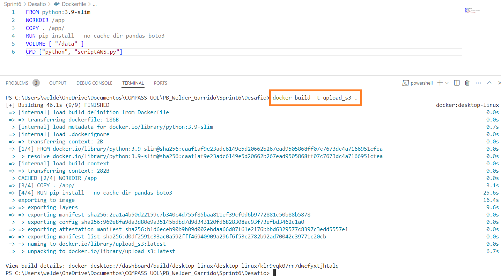  

Ao ser executado, podemos notar que o script retornou sucesso ao enviar os arquivos para o bucket **desafio-final-pb-welder**.  

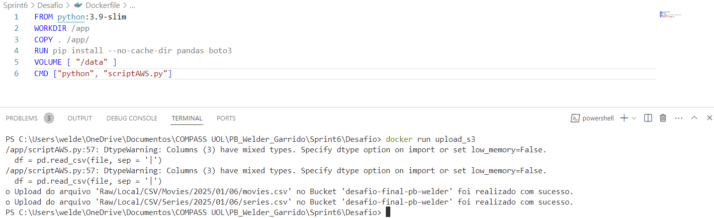  

Agora resta conferir se o caminho criado está correto e se os arquivos foram enviados.  
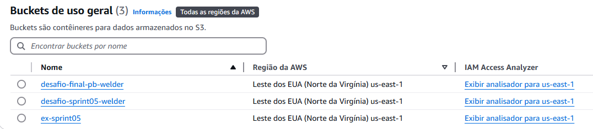  


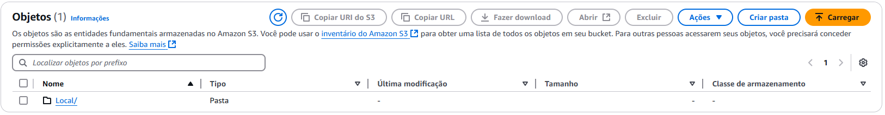
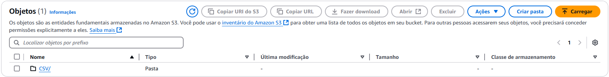
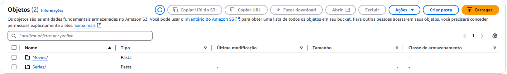

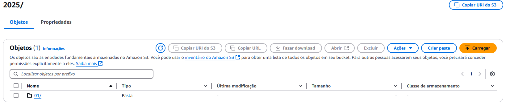
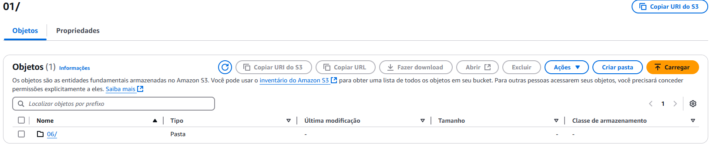
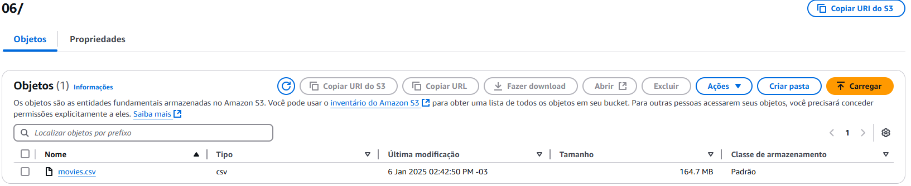
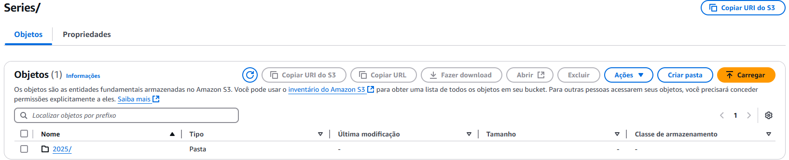

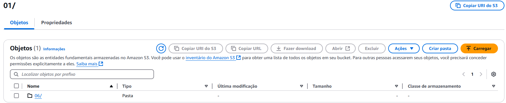
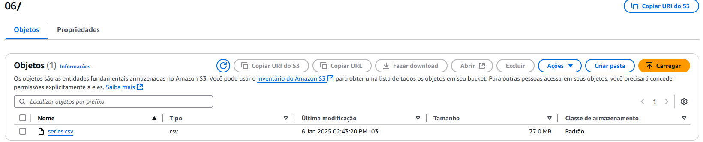


# Links
[📜**Certificados**](/Sprint6/Certificados/)  
[🕵️‍♂️**Evidências** ](/Sprint6/Evidencias/)  
[💪**Exercícios**](/Sprint6/Exercicios/)  
[🖳 **Desafio**](/Sprint6/Desafio/README.md)  