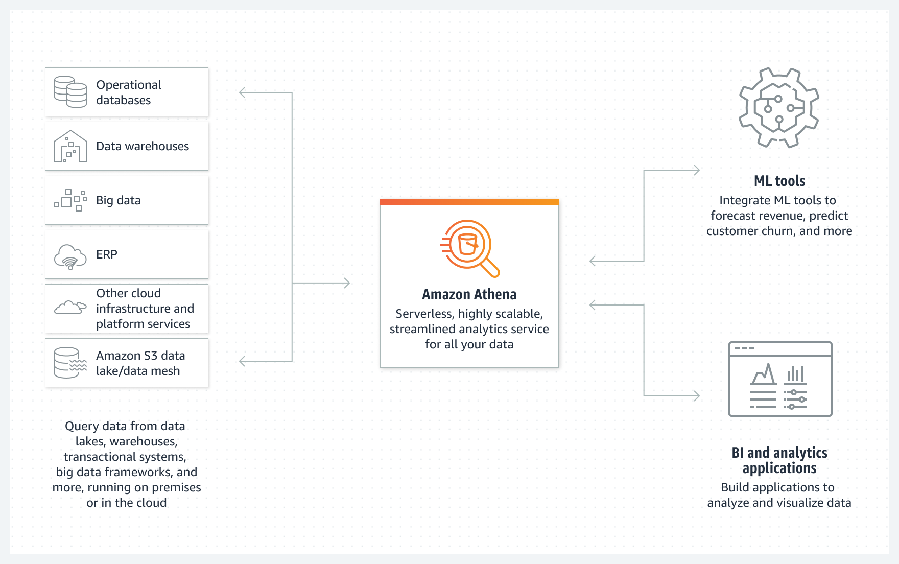

# Resumo
Nessa sprint aprendemos sobre diversos serviços da analytics e um overview sobre os serviços Amazon Athena, AWS Glue, Amazon EMR, Amazon Redshift e Amazon QuickSight. Praticamos através dos laboratórios propostos os serviços S3, Athena e Lambda, os quais darei maior enfoque a seguir.

Aqui darei destaque para o serviço **Amazon S3 (Simple Storage Service)** que foi o serviço que usamos no desenvolvimento de ambos exercício e desafio da sprint.  

## Amazon S3 (Simple Storage Service)
O Amazon Simple Storage Service (Amazon S3) é um serviço de armazenamento de objetos que oferece escalabilidade, disponibilidade de dados, segurança e performance líderes do setor. Clientes de todos os portes e setores podem armazenar e proteger qualquer quantidade de dados de praticamente qualquer caso de uso, como data lakes, aplicações nativas da nuvem e aplicações móveis. Com classes de armazenamento econômicas e recursos de gerenciamento fáceis de usar, você pode otimizar custos, organizar dados e configurar controles de acesso ajustados para atender a requisitos específicos de negócios, organizacionais e de conformidade.

Fonte: https://aws.amazon.com/pt/s3/ (acesso em 23/12/2024)  

Podemos criar um bucket no S3 de modo manual ou via script. Aqui estão os passos para criação manual e no [readme](./Desafio/README.md)  do desafio está ilustrado um exemplo de código para criação de bucket via script.  

Passos:  
    **1**. Faça login no console da AWS como usuário com privilégios de **administrador**.  
    **2**. Selecione o serviço **S3**.  
    **3**. Clique em **criar bucket**.   
    **4**. Insira um **nome** para o bucket.  
    **5**. Selecione uma **região** AWS.  
    **6**. Clique em **criar bucket**.  
# 

## AWS Athena  
O Amazon Athena é um serviço de análise interativo e sem servidor criado em frameworks de código aberto, com suporte a formatos de tabela e arquivo abertos. O Athena fornece uma maneira simplificada e flexível de analisar petabytes de dados onde eles residem. Analise dados ou crie aplicações a partir de um data lake do Amazon Simple Storage Service (S3) e mais de 30 fontes de dados, incluindo fontes de dados on-premises ou outros sistemas em nuvem usando SQL ou Python. O Athena é construído com mecanismos Trino e Presto de código aberto e frameworks Apache Spark, sem necessidade de provisionamento ou configuração.  

Fonte: https://aws.amazon.com/pt/athena/ (acesso em 28/12/2024)

## AWS Lambda  
Lambda é um serviço de computação ideal para cenários de aplicativos que precisam aumentar rapidamente e diminuir para zero quando não há demanda. Por exemplo, você pode usar Lambda para:

Processamento de arquivos: use o Amazon Simple Storage Service (Amazon S3) para acionar o processamento de dados do Lambda em tempo real após um upload.

Processamento de fluxo: use o Lambda e o Amazon Kinesis para processar dados de streaming em tempo real para rastreamento de atividades de aplicativos, processamento de ordens de transações, análise de fluxo de cliques, limpeza de dados, filtragem de logs, indexação, análise de mídia social, telemetria de dados de dispositivos da Internet das Coisas (IoT) e medição.

Aplicativos Web: combine o Lambda com outros serviços da AWS para criar aplicativos Web poderosos que aumentam e diminuem automaticamente e são executados em uma configuração de alta disponibilidade em vários data centers.

Backends de IoT: crie backends sem servidor usando Lambda para lidar com solicitações de API da Web, dispositivos móveis, IoT e de terceiros.

Backends móveis: crie backends usando Lambda e Amazon API Gateway para autenticar e processar solicitações de API. Use o AWS Amplify para integrar facilmente com seus frontends iOS, Android, Web e React Native.

Ao usar o Lambda, você é responsável apenas pelo seu código. O Lambda gerencia a frota de computação que oferece um equilíbrio de memória, CPU, rede e outros recursos para executar seu código. Como o Lambda gerencia esses recursos, você não pode efetuar login em instâncias de computação ou personalizar o sistema operacional em tempos de execução fornecidos. O Lambda executa atividades operacionais e administrativas em seu nome, incluindo gerenciamento de capacidade, monitoramento e registro em log de suas funções do Lambda.  

### Principais características 

Os seguintes recursos principais ajudam você a desenvolver aplicativos Lambda que são escaláveis, seguros e facilmente extensíveis:

**Variáveis ​​de ambiente**  
Use variáveis ​​de ambiente para ajustar o comportamento da sua função sem atualizar o código.

**Versões**  
Gerencie a implantação de suas funções com versões, para que, por exemplo, uma nova função possa ser usada para testes beta sem afetar os usuários da versão de produção estável.

**Imagens de contêiner**  
Crie uma imagem de contêiner para uma função do Lambda usando uma imagem base fornecida pela AWS ou uma imagem base alternativa para que você possa reutilizar suas ferramentas de contêiner existentes ou implantar cargas de trabalho maiores que dependem de dependências consideráveis, como aprendizado de máquina.

**Camadas**  
Empacote bibliotecas e outras dependências para reduzir o tamanho dos arquivos de implantação e tornar mais rápida a implantação do seu código.

**Extensões Lambda**  
Aumente suas funções Lambda com ferramentas para monitoramento, observabilidade, segurança e governança.

**URLs de funções**  
Adicione um ponto de extremidade HTTP(S) dedicado à sua função Lambda.

**Transmissão de resposta**  
Configure seus URLs de função Lambda para transmitir cargas de resposta de volta aos clientes a partir de funções Node.js, para melhorar o desempenho do tempo até o primeiro byte (TTFB) ou para retornar cargas maiores.

**Controles de simultaneidade e dimensionamento**  
Aplique controle refinado sobre o dimensionamento e a capacidade de resposta dos seus aplicativos de produção.

**Assinatura de código**  
Verifique se apenas desenvolvedores aprovados publicam código inalterado e confiável em suas funções Lambda

**Rede privada**  
Crie uma rede privada para recursos como bancos de dados, instâncias de cache ou serviços internos.

**Acesso ao sistema de arquivos**  
Configure uma função para montar um Amazon Elastic File System (Amazon EFS) em um diretório local, para que seu código de função possa acessar e modificar recursos compartilhados com segurança e alta simultaneidade.

**Lambda SnapStart para Java**  
Melhore o desempenho de inicialização dos tempos de execução Java em até 10x sem custo extra, normalmente sem alterações no código da sua função.

**Fonte:** Documentação oficial AWS
#  

# Exercícios  
1. Execução da função no lambda.

  

2. Execução da query no Athena  

3. Exercício sobre s3 já havia sido feito na sprint anterior.

# Links
[📜**Certificados**](/Sprint6/Certificados/)  
[🕵️‍♂️**Evidências** ](/Sprint6/Evidencias/)  
[💪**Exercícios**](/Sprint6/Exercicios/)  
[🖳 **Desafio**](/Sprint6/Desafio/README.md)  