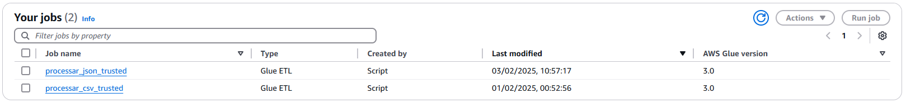
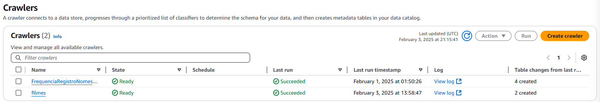
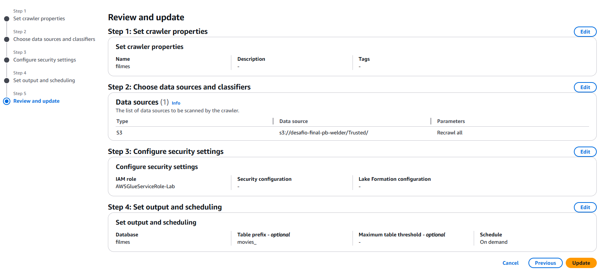
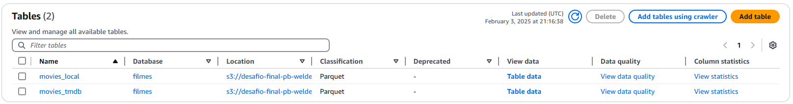
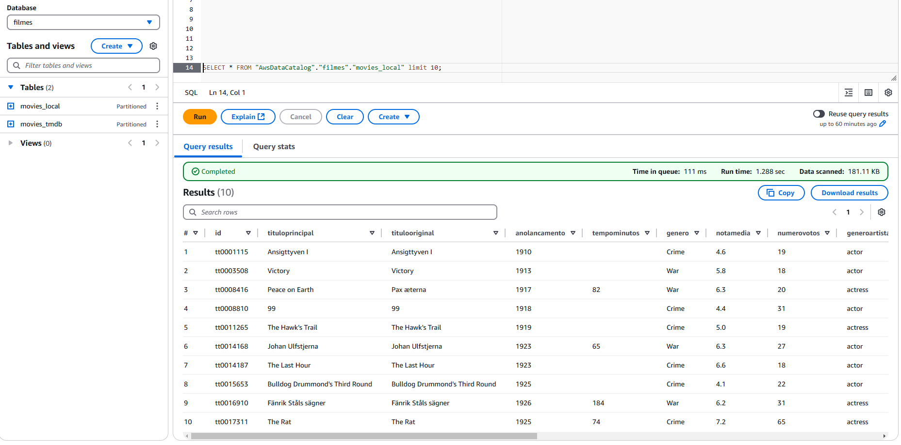

# Objetivo  
O objetivo é praticar a combinação de conhecimentos vistos no programa e fazer um mix de tudo que já foi dito.  

# Perguntas  

Aqui serão analisadas perguntas referentes aos filmes e séries dos gêneros crime e/ou guerra.  

1. **Qual é a distribuição da nota média dos filmes e séries por gênero crime/guerra?**  
**Motivo da análise:** Pode ser um indicativo da preferência do público por um determinado formato de mídia, além de verificar se existe uma tendência à filmes terem nota média maiores do que séries ou vice-versa.  

2. **Existe uma correlação entre a idade dos artistas e as notas médias dos filmes e séries em que atuaram?**  
**Motivo da análise:** A análise pode revelar se existe uma tendência de que atores mais jovens ou mais velhos tenham desempenho melhor, além de poder, possivelmente, mostrar uma visão sobre a importância de diferentes faixas etárias nas indústrias de filmes e séries.  

3. **Como o tempo de duração dos filmes e das séries se relaciona com a nota média e com o número de votos?**  
**Motivo da análise:** Perceber se existe alguma preferência por filmes e séries mais longos ou mais curtos.  

4. **Quais são o filme e a série com maior número de votos da última década?**  
**Motivo da análise:** verificar se existe relação entre os enredos e também se possuem artistas em comum.  

5. **Quais artistas têm a maior nota média?**  
**Motivo da análise:** Avaliar quais artistas são mais frequentemente bem avaliados e montar um ranking, por exemplo, Top 5 Artistas mais bem avaliados das séries e dos filmes.  

#

# Instruções Gerais  
**Ingestão de API:**  
Nesta etapa do desafio iremos capturar dados do TMDB via AWS Lambda realizando chamadas de API.
Os dados coletados devem ser persistidos em Amazon S3, camada RAW Zone, mantendo o formato da origem (JSON) , agrupando-os
em arquivos com, no máximo, 100 registros cada arquivo.

**Informações importantes:**  

- Os arquivos JSON gerados não devem ter mais que 10MB  

- Não agrupar JSON com estruturas diferentes

- Os IDs do IMDB presentes nos arquivos CSV podem ser utilizados em pesquisas no TMDB  


**No serviço AWS Lambda, realize os passos:**  

1. Se necessário, criar nova camada (layer) no AWS lambda para as libs necessárias à ingestão de dados (por exemplo, tmdbv3api, se utilizar o TMDB)

2. Implementar código python em AWS lambda para consumo de dados do TMDB 

3. Se está utilizando TMDB, buscar pela API os dados que complementem a análise. Se achar importante, agrupar os
retornos da API em arquivo JSON com, no máximo, 100 registros cada.

4. Utilizar a lib boto3 para gravar os dados no AWS S3.
	- no momento da gravação dos dados deve-se considerar o padrão do path:
	desafio-final-pb-welder\Raw\TMDB\JSON\<data_de_processamento_separada_por_ano\mes\dia>\<arquivo>
	
	exemplos:
	- S3:\\data-lake-do-fulano\Raw\TMDB\JSON\2022\05\02\prt-uty-nfd.json
	- S3:\\data-lake-do-fulano\Raw\TMDB\JSON\2022\05\02\idf-uet-wqt.json   
	
**Informação adicional:**  
Podemos utilizar os serviços do CloudWatch Event ou Amazon EventBridge para agendar extrações periódicas de dados de 
forma automática.

# Códigos e Execução  
- Para fazer o envio dos arquivos ao bucket do S3 foram usadas as funções abaixo:
```python 
def enviar_arquivo(bucket_name, file_path, object_name, s3_client):
    try:
        s3_client.upload_file(file_path, bucket_name, object_name)
        print(f"Upload do arquivo '{object_name}' no Bucket '{bucket_name}' foi realizado com sucesso.")
    except FileNotFoundError:
        print(f"Erro: O arquivo '{file_path}' não foi encontrado.")
    except ClientError as e:
        print(f"Erro ao enviar o arquivo para o S3: {e}")
    except Exception as exc:
        print(f"Erro inesperado: {exc}")
```
```python
def build_s3_path(file, bucket_name='desafio-final-pb-welder'):
    date = datetime.now()
    year = date.year
    month = date.month
    day = date.day
    path = f"Raw/TMDB/JSON/{year}/{month:02d}/{day:02d}/{file}"
    return path
```  

Para puxar os dados da API do TMDB foi usado o código abaixo:  
```python 
def fetch_tmdb_data(api_key, media_type='movie', page=1, genres=[80, 10752]):
    all_results = []  # Lista para armazenar todos os resultados combinados
    
    for genre_id in genres:  # Iterar sobre os gêneros especificados
        url = f'https://api.themoviedb.org/3/discover/{media_type}?api_key={api_key}&page={page}&with_genres={genre_id}'
        response = requests.get(url)
        
        if response.status_code == 200:
            all_results.extend(response.json().get('results', []))  # Adicionar os resultados à lista
        else:
            print(f"Erro ao buscar dados do TMDB para o gênero {genre_id}: {response.status_code}")
    
    return all_results
```  

Por fim, a função lambda_handler utilizada para rodar o código na AWS:  
```python 
def lambda_handler(event, context):
    #variáveis de ambiente
    api_key = os.environ['TMDB_API_KEY']
    bucket_name = 'desafio-final-pb-welder'
    
    #inicializando client S3
    s3_client = boto3.client('s3')
    
    #tipos de mídia (filmes e séries)
    media_types = ['movie', 'tv']  # 'movie' para filmes e 'tv' para séries
    
    #gêneros de interesse (crime = 80, guerra = 10752)
    genres = [80, 10752]
    
    for media_type in media_types:
        all_data = []
        page = 1
                
        while True:
            data = fetch_tmdb_data(api_key, media_type, page, genres)
            if not data:  #caso não haver mais dados, parar para evitar loop infinito.
                break
            all_data.extend(data)
            page += 1
        
        #dividindo o arquivo em subarquivos
        for idx, data_chunk in enumerate(dividir_json(all_data, max_registros=100)):
            #criando arquivo JSON temporário em /tmp
            file_name = f"/tmp/{media_type}_dados_{datetime.now().strftime('%Y%m%d%H%M%S')}_{idx + 1}.json"
            with open(file_name, 'w', encoding='utf-8') as f:
                json.dump(data_chunk, f, ensure_ascii=False, indent=4)
            
            s3_path = build_s3_path(file_name.split('/')[-1], bucket_name)
            
            enviar_arquivo(bucket_name, file_name, s3_path, s3_client)

            #removendo o arquivo local após envio para o S3
            os.remove(file_name)
        
    return {
        'statusCode': 200,
        'body': json.dumps('Arquivos processados e enviados para o S3 com sucesso.')
    }
```

Para a execução correta do código no AWS Lambda foi necessário criar uma camada (layer) para a biblioteca **requests**.  
Para tal, foi criado um diretório requests e um subdiretório python, onde foi instalada a biblioteca através do método pip install requests. Feito isso, a pasta foi zipada e feito o upload na plataforma AWS Lambda.  

Um ponto a ser destacado é que, em relação à sprint anterior, há uma pequena alteração no script em relação às credenciais de acesso que não são mais necessárias, uma vez que já estamos em ambiente AWS. Por outro lado, foi necessário criar um perfil de usuário do IAM para permitir a manipulação de arquivos em buckets S3 através do lambda.

Outro ponto a ser destacado é a configuração da variável ambiente para a chave da API do TMDB como uma boa prática, para não expôr os dados no código.









# Links
[📜**Certificados**](/Sprint7/Certificados/)  
[🕵️‍♂️**Evidências** ](/Sprint7/Evidencias/)  
[💪**Exercícios**](/Sprint7/Exercicios/)  
[🖳 **Desafio**](/Sprint7/Desafio/README.md)  