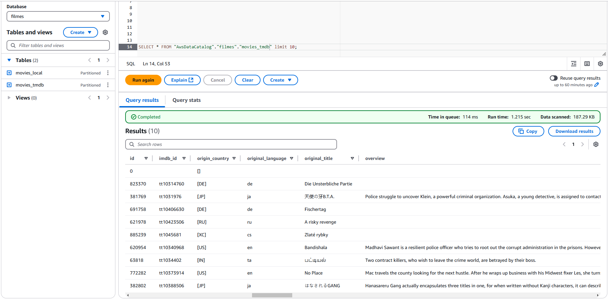

# Objetivo  
O objetivo é praticar a combinação de conhecimentos vistos no programa e fazer um mix de tudo que já foi dito.  

# Perguntas  

Aqui serão analisadas perguntas referentes aos filmes dos gêneros crime e/ou guerra. Em relação à Sprint anterior, houve mudanças de algumas perguntas para a análise. 

1. **Qual é a distribuição da nota média dos filmes por gênero crime/guerra nas últimas 5 décadas?**  
**Motivo da análise:** Verificar a preferência do público em relação a cada um dos gêneros citados.  

2. **Como o tempo de duração dos filmes se relaciona com a nota média e com o número de votos nas últimas 5 décadas?**  
**Motivo da análise:** Perceber se existe alguma preferência por filmes mais longos ou mais curtos.  

3. **Qual é o filme de cada gênero com maior número de votos das últimas 5 décadas?**
**Motivo da análise:** Verificar se possuem artistas em comum e o enredo dos filmes de maior sucesso para entender se existe uma correlação.  

4. **Qual é a proporção de filmes war/crime nas últimas 5 décadas?**  
**Motivo da análise:** Entender se a preferência por um gênero se mantém ou se há oscilações de preferência. Caso haja, qual o motivo para tais oscilações?  

5. **Qual(is) é (são) o(s) país(es) que mais produz(em) filmes de cada gênero nas últimas 5 décadas?**  
**Motivo da análise:** Verificar uma possível fonte e parcerias entre produtoras de países estrangeiros com países que mais produzem filmes desses gêneros.  

6. **Qual é a principal língua falada em cada gênero nas últimas 5 décadas?**  
**Motivo da análise:** Avaliar se existe uma tendência ou preferência por uma determinada língua.  

#

# Instruções Gerais  
**Processamento da camada Trusted:**
a camada trusted de um data lake corresponde àquela em que os dados encontram-se limpos e são confiáveis. 
É resultado da integração das diversas fontes de origem, que encontram-se na camada anterior, que chamamos Raw.

Aqui faremos o uso do **apache spark** no processo, através do serviço **AWS Glue**, integrando dados existentes na camada 
Raw Zone para a Trusted Zone.  
O objetivo é gerar uma visão padronizada dos dados, persistida no S3, disponível num database do Glue Data Catalog e acessível via **AWS Athena** compreendendo a **Trusted Zone** do data lake.  
Assim, todos os dados da Trusted Zone possuem o mesmo formato de armazenamento e **todos podem ser analisados no 
AWS Athena através de comandos SQL.**

Todos os dados serão persistidos na Trusted no formato **PARQUET**, particionados por data de criação do arquivo 
no momento da ingestão do dado do TMDB. Deve-se considerar o padrão:

**\origem do dado\formato do dado\especificação do dado\data de ingestão separada por ano\mes\dia\arquivo.**  
**Exemplo:**
```
s3://desafio-final-pb-welder/Trusted/TMDB/Parquet/movies/Ano/Mes/Dia/movies.parquet  

s3://desafio-final-pb-welder/Trusted/Local/Parquet/movies/movies.parquet
```

A exceção fica para os dados oriundos do processamento batch (CSV), que não precisam ser particionados.

Todos os jobs Spark serão criados por meio do AWS Glue. Iremos separar o processamento em **dois jobs**:   
- O primeiro, será responsável pelo processamento dos arquivos CSV e o segundo pelo processamento dos dados  

- Oriundos da API TMDB. Lembre-se que suas origens serão os dados existentes na RAW Zone.

**Não use notebooks do Glue.**

Desenvolva os Jobs no Glue utilizando a opção spark script editor. Após, na aba job details, atente para as seguintes opções:
- worker type: informe G 1x (opção de menor configuração)
- requested number of workers: informe 2, que é a quantidade mínima.
- job timeout (minutes): mantenha 60 ou menos, se possível.


# Códigos e Execução  

**Processamento do arquivo CSV**  
```python
import sys
from pyspark.context import SparkContext
from pyspark.sql import SparkSession
from pyspark.conf import SparkConf
from awsglue.context import GlueContext
from awsglue.job import Job
from awsglue.dynamicframe import DynamicFrame
import pyspark.sql.functions as F
import pyspark.sql.types as T
from awsglue.utils import getResolvedOptions

args = getResolvedOptions(sys.argv, ['JOB_NAME', 'S3_INPUT_PATH', 'S3_TARGET_PATH'])

sc = SparkContext()
glueContext = GlueContext(sc)
spark = glueContext.spark_session
job = Job(glueContext)
job.init(args['JOB_NAME'], args)

source_file = args['S3_INPUT_PATH']
target_path = args['S3_TARGET_PATH']

# Definição dos tipos das colunas
schema = T.StructType([
    T.StructField("id", T.StringType(), True),
    T.StructField("tituloPincipal", T.StringType(), True),  
    T.StructField("tituloOriginal", T.StringType(), True),
    T.StructField("anoLancamento", T.IntegerType(), True),
    T.StructField("tempoMinutos", T.IntegerType(), True),  # Pode conter valores "\N"
    T.StructField("genero", T.StringType(), True),
    T.StructField("notaMedia", T.DoubleType(), True),
    T.StructField("numeroVotos", T.IntegerType(), True),
    T.StructField("generoArtista", T.StringType(), True),
    T.StructField("personagem", T.StringType(), True),
    T.StructField("nomeArtista", T.StringType(), True),
    T.StructField("anoNascimento", T.StringType(), True),  # Pode conter valores "\N"
    T.StructField("anoFalecimento", T.StringType(), True),  # Pode conter valores "\N"
    T.StructField("profissao", T.StringType(), True),
    T.StructField("titulosMaisConhecidos", T.StringType(), True)
])

# Lendo o arquivo CSV
df = spark.read.csv(source_file, schema=schema, sep='|', header=True)

# Corrigindo o nome da coluna
df = df.withColumnRenamed("tituloPincipal", "tituloPrincipal")

# Exibindo as 10 primeiras linhas no log
df.show(10)

# Escrevendo no formato Parquet
#df.write.mode("overwrite").parquet(target_path)
df.coalesce(1).write.mode("overwrite").parquet(target_path)

# Finalizando o job
job.commit()
```  

**Processamento dos JSON**  
```python
import sys
from awsglue.transforms import *
from awsglue.utils import getResolvedOptions
from awsglue.context import GlueContext
from awsglue.job import Job
from pyspark.context import SparkContext

# Obter argumentos do Glue
args = getResolvedOptions(sys.argv, ['JOB_NAME', 'S3_INPUT_PATH', 'S3_TARGET_PATH'])
input_path = args['S3_INPUT_PATH']
target_path = args['S3_TARGET_PATH']

# Criar contexto do Glue
sc = SparkContext()
glueContext = GlueContext(sc)
spark = glueContext.spark_session
job = Job(glueContext)
job.init(args['JOB_NAME'], args)

# Ler todos os arquivos JSON da pasta
df = spark.read.option("multiline", "true").json(input_path)

# Salvar como Parquet
df.write.mode("overwrite").parquet(target_path)

print(f"Arquivos Parquet salvos em: {target_path}")

job.commit()
```
**OBS:** no processamento dos arquivos JSON optei por não definir o schema devido a problemas de processamento que encontrei. Sendo assim, o spark fez a inferência e o que precisar ser alterado, será feito via script no momento da análise dos dados.  

# Resultados das Execuções  
**JOBS GLUE**
  
#
**Crawler**
  
#
**Configuração do crawler**
  
#
**Database Filmes Gerado**
  
#
**Tabelas**
  
#
**Athena - Query para verificação dos dados oriundos do CSV**
  
#
**Athena - Query para verificação dos dados oriundos dos JSON**
  
#

# Links
[📜**Certificados**](/Sprint8/Certificados/)  
[🕵️‍♂️**Evidências** ](/Sprint8/Evidencias/)  
[💪**Exercícios**](/Sprint8/Exercicios/)  
[🖳 **Desafio**](/Sprint8/Desafio/README.md)  