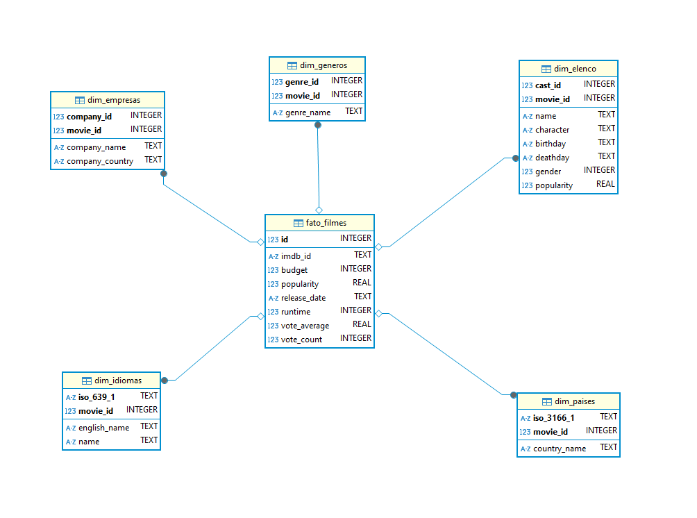

# Objetivo  
O objetivo é praticar a combinação de conhecimentos vistos no programa e fazer um mix de tudo que já foi dito.  

# Perguntas  

Aqui serão analisadas perguntas referentes aos filmes dos gêneros crime e/ou guerra. 

1. **Qual é a distribuição da nota média dos filmes por gênero crime/guerra nas últimas 5 décadas?**  
**Motivo da análise:** Verificar a preferência do público em relação a cada um dos gêneros citados.  

2. **Como o tempo de duração dos filmes se relaciona com a nota média e com o número de votos nas últimas 5 décadas?**  
**Motivo da análise:** Perceber se existe alguma preferência por filmes mais longos ou mais curtos.  

3. **Qual é o filme de cada gênero com maior número de votos das últimas 5 décadas?**
**Motivo da análise:** Verificar se possuem artistas em comum e o enredo dos filmes de maior sucesso para entender se existe uma correlação.  

4. **Qual é a proporção de filmes war/crime nas últimas 5 décadas?**  
**Motivo da análise:** Entender se a preferência por um gênero se mantém ou se há oscilações de preferência. Caso haja, qual o motivo para tais oscilações?  

5. **Qual(is) é (são) o(s) país(es) que mais produz(em) filmes de cada gênero nas últimas 5 décadas?**  
**Motivo da análise:** Verificar uma possível fonte e parcerias entre produtoras de países estrangeiros com países que mais produzem filmes desses gêneros.  

6. **Qual é a principal língua falada em cada gênero nas últimas 5 décadas?**  
**Motivo da análise:** Avaliar se existe uma tendência ou preferência por uma determinada língua.  

#

# Instruções Gerais  
**Processamento da camada Refined:**
A camada refined de um datalake corresponde à camada onde os dados estão prontos e tratados para consumo. 
É resultado da integração das diversas fontes de origem, que encontram-se na camada anterior, que chamamos Trusted.

Aqui faremos o uso do **apache spark** no processo, através do serviço **AWS Glue**, integrando dados existentes na camada 
Trusted Zone para a Refined Zone.  
O objetivo é gerar uma visão padronizada dos dados, persistida no S3, disponível num database do Glue Data Catalog e acessível via **AWS Athena** compreendendo a **Refined Zone** do data lake.  
Assim, todos os dados da Refined Zone possuem o mesmo formato de armazenamento e **todos podem ser analisados no 
AWS Athena através de comandos SQL.**


O job spark foi criado através do AWS Glue e tem como objetivo criar o modelo dimensional dos dados que serão usados na análise para responder às perguntas citadas anteriormente. 

Primeiramente, o modelo a ser criado está ilustrado na figura a seguir: 
  

Esse modelo tem como objetivo separar os dados em tabelas menores (dimensões) interligadas pela tabela fato. Para cada tabela, existe um ou mais campos de chave primária simples ou composta.

Vale ressaltar que nem todos os dados serão usados na análise, porém decidi criar as tabelas com dados a mais para que, em caso futuro, a análise seja facilmente expansível.  

# Códigos e Execução  
O código do job executado no glue pode ser encontrado na íntegra clicando [aqui](../Desafio/processamento_refined.py)
 
```python
import sys
from awsglue.transforms import *
from awsglue.utils import getResolvedOptions
from awsglue.context import GlueContext
from awsglue.job import Job
from pyspark.context import SparkContext
from pyspark.sql.functions import explode, col
from awsglue.dynamicframe import DynamicFrame

args = getResolvedOptions(sys.argv, ['JOB_NAME', 'S3_INPUT_PATH', 'S3_TARGET_PATH'])
input_path = args['S3_INPUT_PATH']
target_path = args['S3_TARGET_PATH']

sc = SparkContext()
glueContext = GlueContext(sc)
spark = glueContext.spark_session
job = Job(glueContext)
job.init(args['JOB_NAME'], args)
```  
No trecho acima são importadas as bibliotecas necessárias e também configurados os parâmetros de variável ambiente 'S3_INPUT_PATH' e 'S3_TARGET_PATH'. Em S3_INPUT_PATH o caminho é direcionado para a trusted zone (s3://desafio-final-pb-welder/Trusted/TMDB/) e em S3_TARGET_PATH o caminho é direcionado para o diretório Refined (s3://desafio-final-pb-welder/Refined/) onde serão criadas as tabelas via execução do Crawler.  


# Links
[📜**Certificados**](/Sprint9/Certificados/)  
[🕵️‍♂️**Evidências** ](/Sprint9/Evidencias/)  
[💪**Exercícios**](/Sprint9/Exercicios/)  
[🖳 **Desafio**](/Sprint9/Desafio/README.md)  